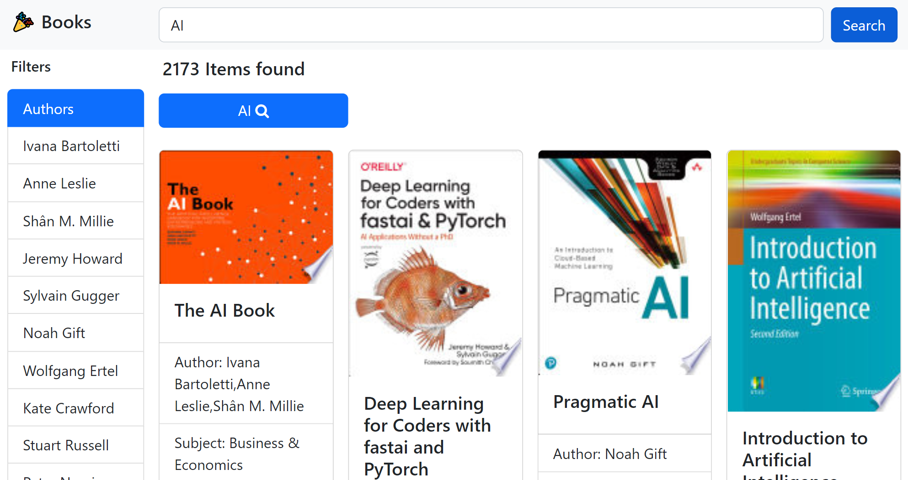
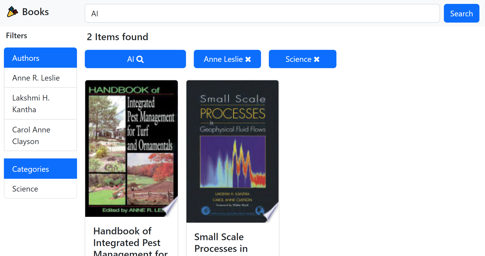
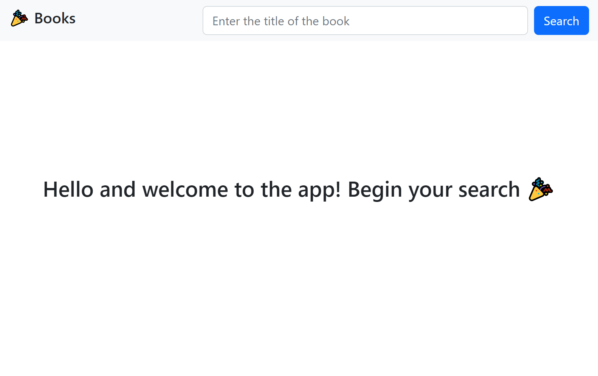

## 🎉Library management page

Try now! [click here](https://ubooks-app.herokuapp.com/#)

### Problem Statement
Build a simple library management page where
- Users should be able to see the list of books
    - Instead of loading all the results on the page, perform paging on the list of books - either implement 10 results per page or load on scroll will be a bonus
- Users should be able to filter the list of books based on Title, Author, Subject and Publish - date
    - User should be able to see the count of books in based on each criteria [ Title, Author, Subject and publish-date

### if you want to test, this project
- step 1: create .env file
- step 2: get google books api key
- step 3: add API_KEY_VALUE = <YOUR API KEY> in .env file

## Sceenshots

### filtered results

### welcome page
